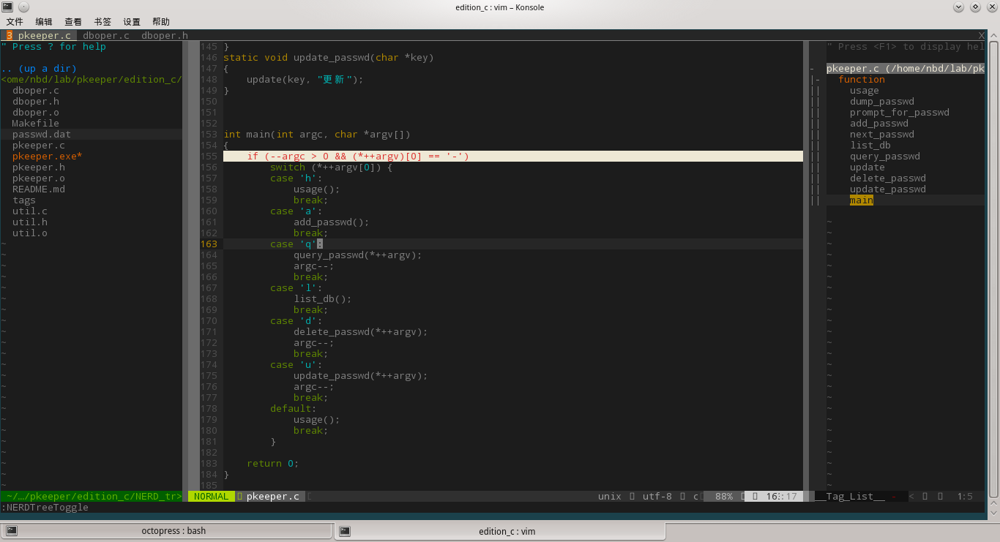

## 说明

这是本人的一份vim配置备份(加了一些其他资源)。仅配置了一些常用功能、插件，力求做到精简、实用(less is more)：

+ silarzed主题: dark
+ 标签页切换: ctrl + [h | l]
+ 目录树: ctrl + f 打开/关闭
+ taglist: vim中使用`:Tlist`打开/关闭
+ 书签: 使用mm在当前行 [设置 | 取消] 书签，使用 [F2 | shift+F2] 上下切换标签
+ 状态栏: 需要安装额外字体，方能显示全部效果
+ ctags
+ emmet
+ markdown


### 安装说明

关于 silarzed主题的配置(vimrc中，99行)，终端模式下，默认使用终端的配置(比如透明)，这样对于没有配置终端透明的情况来说，主题会显得尤其别扭，这时只需将以下配置注释掉就行了(108行)，如下

    " let g:solarized_termtrans=1


+ linux 平台

    ``` bash
    $ git clone git@github.com:ssir/backup_vim.git
    $ cd backup_vim
    $ ./install.sh
    ```

+ win 平台

    - 将 setting 目录下的 vimfiles_win 重命名为 vimfiles, 然后将它与 _vimrc 文件一起拷贝到 gvim 的安装目录“C:\Program Files (x86)\Vim”下(原有的同名文件、文件夹一并删除)

    - 将 others 目录下 ctags58.zip 文件中 ctags.exe 文件拷贝到 gvim 安装目录 “C:\Program Files (x86)\Vim\vim74”中。

安装完成后，打开 [vim | gvim]，运行 `:Helptags`，生成插件的帮助文档。


### 效果截图



(完)


